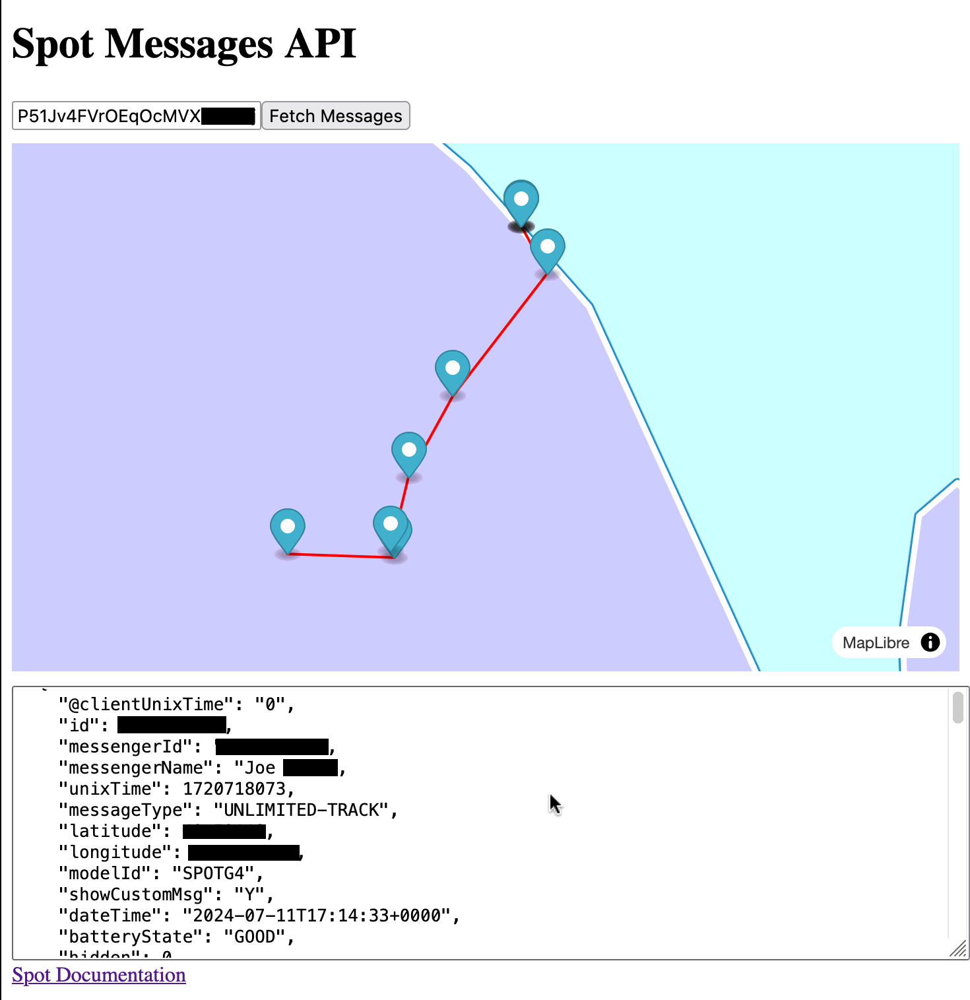

# Spot API

A JavaScript Library for interacting with the Find Me [Spot Messaging API](https://www.findmespot.com/en-us/support/spot-gen4/get-help/general/public-api-and-xml-feed).



## Development

```bash
# Install dependencies
npm install

# Build the library
npm run build

# Run the Development app
npm run dev
```
